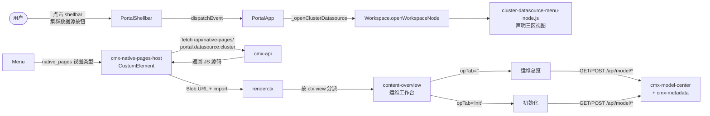
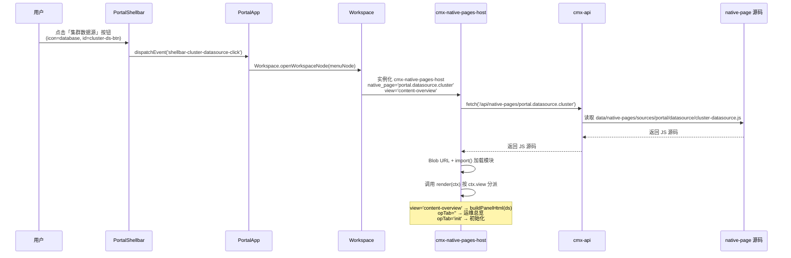
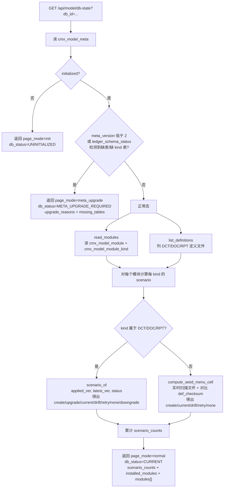
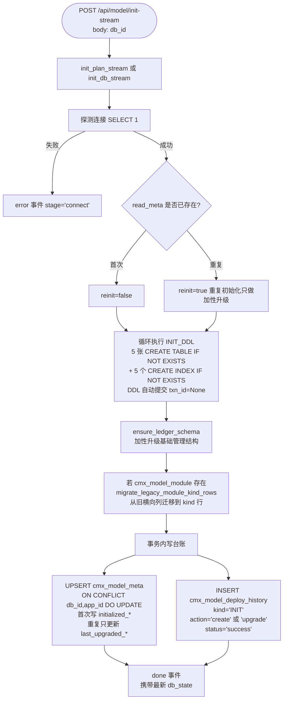
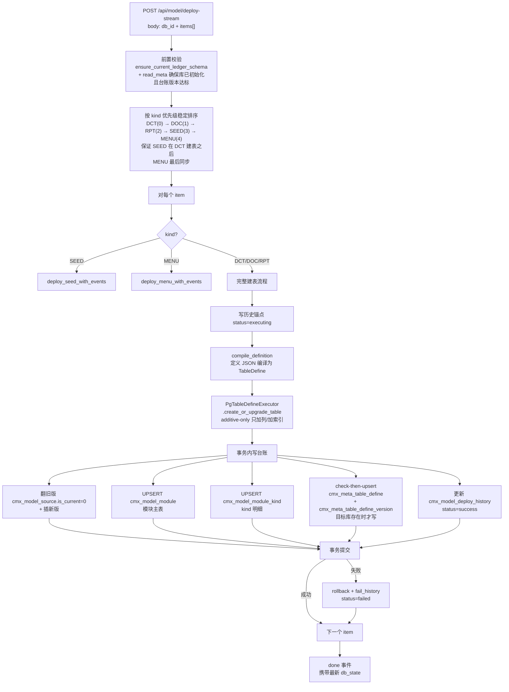
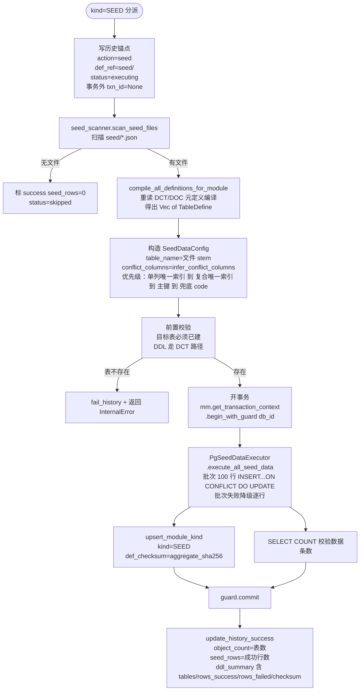
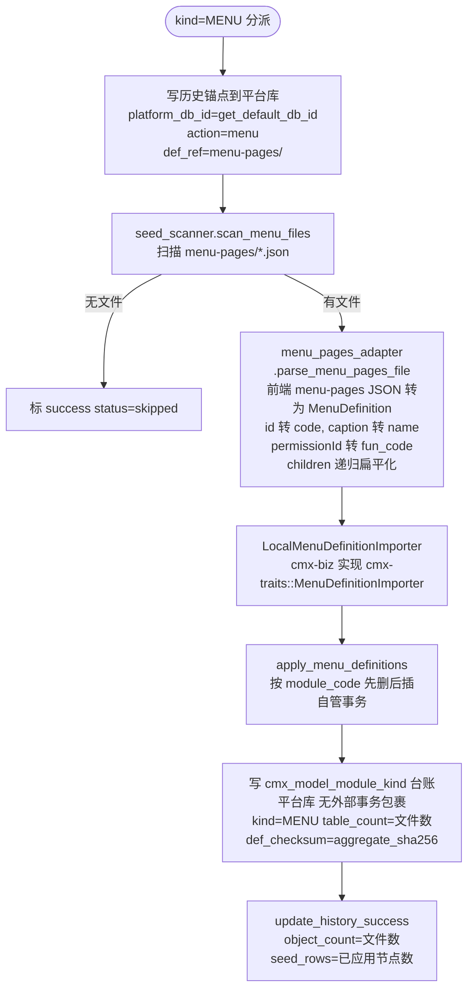

# 数据库运维工作台 - 后台设计分析

> 范围：CMXPortalManager「集群数据源」→「概览」tab 下的「数据库运维工作台」，重点剖析「初始化」与「运维总览」两个子模块的后台实现。
>
> 涉及代码：
> - 前端入口：[`..`](file:///media/yqs/工作/rustspace/cmx/CMXPortalManager/src/lib/cluster-datasource-menu-node.js)、[`portal-app.js`](file:///media/yqs/工作/rustspace/cmx/CMXPortalManager/src/components/portal-app.js)、[`portal-shellbar.js`](file:///media/yqs/工作/rustspace/cmx/CMXPortalManager/src/components/portal-shellbar.js)、[`workspace-native-pages.js`](file:///media/yqs/工作/rustspace/cmx/CMXPortalManager/src/lib/workspace-native-pages.js)
> - 前端业务 UI（后端 native-page）：[`cmx-container/data/native-pages/sources/portal/datasource/cluster-datasource.js`](file:///media/yqs/工作/rustspace/cmx/cmx-container/data/native-pages/sources/portal/datasource/cluster-datasource.js)
> - 后端服务层：[`cmx-container/crates/libs/cmx-model-center/`](file:///media/yqs/工作/rustspace/cmx/cmx-container/crates/libs/cmx-model-center)
> - 后端元数据基础库：[`cmx-container/crates/libs/cmx-metadata/`](file:///media/yqs/工作/rustspace/cmx/cmx-container/crates/libs/cmx-metadata)
> - HTTP handler：[`cmx-api/src/handlers/portal/handler.rs`](file:///media/yqs/工作/rustspace/cmx/cmx-container/crates/libs/cmx-api/src/handlers/portal/handler.rs)（L1671-1933）
> - DDL：[`cmx-container/docs/sql/init/init_ddl.sql`](file:///media/yqs/工作/rustspace/cmx/cmx-container/docs/sql/init/init_ddl.sql)（L2218-2511）

---

## 一、整体架构

「数据库运维工作台」采用**前后端分离 + native-page 动态加载**的特殊架构：



**关键特点**：
1. **前端 CMXPortalManager 不含业务 UI 代码**——只有菜单节点声明（`cluster-datasource-menu-node.js`）和入口逻辑（`portal-app.js` 的 `_openClusterDatasource`）。
2. **真正的运维工作台 UI 全部在后端 native-page 文件** [`cluster-datasource.js`](file:///media/yqs/工作/rustspace/cmx/cmx-container/data/native-pages/sources/portal/datasource/cluster-datasource.js)（约 2435 行），前端通过 `/api/native-pages/portal.datasource.cluster` 动态拉取 JS 源码，用 Blob URL + `import()` 加载并执行 `render(ctx)` 函数。
3. **后端分两层**：`cmx-model-center` 是服务/落库层（台账管理、部署编排），`cmx-metadata` 是元数据处理基础库（DDL 生成/解析/diff/执行、种子数据执行）。

---

## 二、后台分层设计

### 2.1 三层职责划分

| 层 | Crate / 文件 | 职责 |
|----|-------------|------|
| HTTP handler 层 | `cmx-api/src/handlers/portal/handler.rs`（L1671-1933） | 参数解析、SSE 通道桥接、认证上下文提取（`model_operator` 从 `auth_context` 取 `user_id`/`username`，缺省 `("system", "系统")`） |
| 服务/落库层 | `cmx-model-center`（`lib.rs` ~3140 行 + 3 个辅助文件） | `db_state` / `init_db` / `deploy` + 4 个 SSE 流式变体；编译 DCT/DOC/RPT 定义；台账读写；部署历史记录；SEED/MENU 部署分派 |
| 元数据基础库 | `cmx-metadata`（8 个子模块） | JSON→TableDefine 加载、DDL 生成/解析、增量 DDL diff（additive-only）、PG 表结构内省、种子数据执行（JSON/CSV，批次失败降级逐行） |

### 2.2 cmx-model-center 源文件分工

| 文件 | 行数 | 作用 |
|------|------|------|
| [`src/lib.rs`](file:///media/yqs/工作/rustspace/cmx/cmx-container/crates/libs/cmx-model-center/src/lib.rs) | ~3140 | 主体：7 个 public fn + `InitEvent` struct + 编译器（DCT/DOC/RPT→TableDefine）+ DB 内省辅助 + diff 报告 + 台账读取 + `INIT_DDL` 常量 + 部署主流程 `deploy_with_events` |
| [`src/deploy_seed_menu.rs`](file:///media/yqs/工作/rustspace/cmx/cmx-container/crates/libs/cmx-model-center/src/deploy_seed_menu.rs) | ~460 | SEED/MENU 部署业务编排：`infer_conflict_columns`（冲突列推断）、`compile_all_definitions_for_module`、`deploy_seed_with_events`、`deploy_menu_with_events` |
| [`src/menu_pages_adapter.rs`](file:///media/yqs/工作/rustspace/cmx/cmx-container/crates/libs/cmx-model-center/src/menu_pages_adapter.rs) | ~150 | 前端 menu-pages JSON → 后端 `MenuDefinition` 适配（`id→code`、`caption→name`、`permissionId→fun_code`、`children` 递归扁平化） |
| [`src/seed_scanner.rs`](file:///media/yqs/工作/rustspace/cmx/cmx-container/crates/libs/cmx-model-center/src/seed_scanner.rs) | ~150 | 扫描 `<data_root>/meta/definitions/<domain>/<app>/<module>/seed/*.json` 与 `<data_root>/menu-pages/<domain>/<app>/<module>/*.json`；`aggregate_sha256` 模块级聚合 hash |

### 2.3 cmx-metadata 源文件分工

| 文件 | 作用 |
|------|------|
| [`src/lib.rs`](file:///media/yqs/工作/rustspace/cmx/cmx-container/crates/libs/cmx-metadata/src/lib.rs) | 库入口，re-export 公开 API |
| [`src/executor.rs`](file:///media/yqs/工作/rustspace/cmx/cmx-container/crates/libs/cmx-metadata/src/executor.rs) | `PgTableDefineExecutor` + `TableDefineDbExecutor` trait；`query_current_table_define` 通过 `information_schema` + `pg_index` + `pg_attribute` + `obj_description` + `col_description` 还原当前表结构 |
| [`src/ddl/mod.rs`](file:///media/yqs/工作/rustspace/cmx/cmx-container/crates/libs/cmx-metadata/src/ddl/mod.rs) | `DdlDialect` trait + 便捷函数 |
| [`src/ddl/postgres.rs`](file:///media/yqs/工作/rustspace/cmx/cmx-container/crates/libs/cmx-metadata/src/ddl/postgres.rs) | `PostgresDdlDialect` 实现（类型映射、CREATE TABLE/INDEX/COMMENT 生成、ADD/ALTER/DROP COLUMN） |
| [`src/ddl/diff.rs`](file:///media/yqs/工作/rustspace/cmx/cmx-container/crates/libs/cmx-metadata/src/ddl/diff.rs) | `DdlDiff` 增量 DDL 生成（**additive-only**：DropColumn/DropTable 仅记日志不执行；索引按列+类型匹配忽略索引名；精度/标度仅对 Decimal 比较） |
| [`src/parser/postgres.rs`](file:///media/yqs/工作/rustspace/cmx/cmx-container/crates/libs/cmx-metadata/src/parser/postgres.rs) | `PostgresDdlParser` 两遍扫描（CREATE TABLE → CREATE INDEX + COMMENT ON），支持 DDL→TableDefine→DDL round-trip |
| [`src/seed/executor.rs`](file:///media/yqs/工作/rustspace/cmx/cmx-container/crates/libs/cmx-metadata/src/seed/executor.rs) | `PgSeedDataExecutor`：批次（默认 100）INSERT...ON CONFLICT DO UPDATE；批次失败降级逐行；执行后 `SELECT COUNT(*)` 校验 |
| [`src/seed/dml.rs`](file:///media/yqs/工作/rustspace/cmx/cmx-container/crates/libs/cmx-metadata/src/seed/dml.rs) | `generate_pg_insert_or_upsert`：DateTime 数字→`to_timestamp()`、Date/DateTime 字符串→`::date`/`::timestamptz`、Json→`::jsonb` |
| [`src/seed/loader.rs`](file:///media/yqs/工作/rustspace/cmx/cmx-container/crates/libs/cmx-metadata/src/seed/loader.rs) | `load_seed_data`：根据扩展名 .json/.csv 分派解析器 |
| [`src/config.rs`](file:///media/yqs/工作/rustspace/cmx/cmx-container/crates/libs/cmx-metadata/src/config.rs) | `TableDefinesConfigManager`：多套配置 + Kahn 算法拓扑排序（`depends_on` + `priority`） |
| [`src/i18n.rs`](file:///media/yqs/工作/rustspace/cmx/cmx-container/crates/libs/cmx-metadata/src/i18n.rs) | `derive_i18n_table_define`：生成 `<table>_i18n` 伴生表（`ref_id` + `locale` + i18n 列） |

---

## 三、API endpoint 清单

路由注册：[`cmx-api/src/handlers/portal/mod.rs`](file:///media/yqs/工作/rustspace/cmx/cmx-container/crates/libs/cmx-api/src/handlers/portal/mod.rs) L124-136，挂在 `/api` 前缀下。`cmx-api` 通过 `pub use cmx_model_center as model_center;`（mod.rs L9）引入服务层。

| HTTP | 路径 | handler | 后端入口 | 用途 |
|------|------|---------|---------|------|
| GET | `/api/model/db-state?db_id=<key>` | `model_db_state` | `db_state`（lib.rs L1534） | **运维总览数据源**：返回 `page_mode` + `scenario_counts` + `modules[]`（每模块每 kind 的 cell） |
| POST | `/api/model/init` | `model_init` | `init_db`（L1892） | 同步初始化（建台账系统表 + 写 meta + 历史） |
| POST | `/api/model/init-plan-stream` | `model_init_plan_stream` | `init_plan_stream`（L1966） | SSE 流式生成初始化/系统表升级计划（**只读预览**，不落库） |
| POST | `/api/model/init-stream` | `model_init_stream` | `init_db_stream`（L2139） | SSE 流式执行初始化 |
| POST | `/api/model/deploy` | `model_deploy` | `deploy`（L2323） | 同步部署一批定义 |
| POST | `/api/model/deploy-plan-stream` | `model_deploy_plan_stream` | `deploy_plan_stream`（L2362） | SSE 流式生成部署执行计划（**只读预览**） |
| POST | `/api/model/deploy-stream` | `model_deploy_stream` | `deploy_stream`（L2333） | SSE 流式执行模块部署（编译/DDL/台账/历史/完成） |

**请求体契约**：
- `init*`：`{ "db_id": "<目标库 id>" }`
- `deploy*`：`{ "db_id": "...", "items": [{ "kind": "DCT|DOC|RPT|SEED|MENU", "domain": "...", "application": "...", "module": "...", "file": "..." }] }`

**SSE 事件协议**（`InitEvent.kind`）：
- `connect` / `step` / `progress`（含 `index`/`total`）/ `done`（携带 `db_state`）/ `error`（含 `stage`）/ `end`（handler 层补发，前端据此关闭流）

---

## 四、数据库表清单

### 4.1 5 张台账系统表（由 `INIT_DDL` 常量创建，`init_db` 时落库）

来源：[`cmx-model-center/src/lib.rs` L1877-1889](file:///media/yqs/工作/rustspace/cmx/cmx-container/crates/libs/cmx-model-center/src/lib.rs) 与 [`init_ddl.sql` L2218-2482](file:///media/yqs/工作/rustspace/cmx/cmx-container/docs/sql/init/init_ddl.sql)。常量 `LEDGER_TABLES`（lib.rs L42-48）定义这 5 张表清单。

#### 4.1.1 `cmx_model_meta` — 模型中心台账自描述（每库每 app 单例）

| 字段 | 类型 | 作用 |
|------|------|------|
| `id` | VARCHAR(64) PK | 主键 |
| `db_id` | VARCHAR(100) | 数据库 ID |
| `app_id` | VARCHAR(64) DEFAULT 'default' | 应用 ID（多租户/多应用隔离） |
| `meta_version` | INT4 DEFAULT 1 | **台账 schema 版本**，当前 `META_VERSION=2`，用于判定是否需要升级系统表 |
| `engine_version` | VARCHAR(50) | 引擎版本（当前 `ENGINE_VERSION="1.0.0"`） |
| `portal_version` | VARCHAR(50) | 门户版本 |
| `status` | VARCHAR(20) DEFAULT 'ready' | 台账状态：`ready` / `upgrading` / `failed` |
| `initialized_at` | TIMESTAMP | 初始化时间 |
| `initialized_by` / `initialized_name` | VARCHAR(100) | 初始化人 ID / 姓名 |
| `last_upgraded_at` / `last_upgraded_by` | TIMESTAMP / VARCHAR(100) | 最近升级时间 / 升级人 |
| `remark` | VARCHAR(500) | 备注 |
| `create_time` / `update_time` | TIMESTAMP | 创建 / 更新时间 |

**唯一索引**：`uk_model_meta_db_app (db_id, app_id)`

#### 4.1.2 `cmx_model_module` — 模块部署当前态主表（每模块一行）

| 字段 | 类型 | 作用 |
|------|------|------|
| `id` | VARCHAR(64) PK | 主键 |
| `db_id` / `app_id` | VARCHAR | 数据库 ID / 应用 ID |
| `domain_code` / `application_code` / `module_code` | VARCHAR(100) | 三层定位键 |
| `module_name` | VARCHAR(200) | 模块名称 |
| `overall_status` | VARCHAR(20) DEFAULT 'active' | 整体状态：`active` / `failed` |
| `table_count` | INT4 DEFAULT 0 | 表数量 |
| `def_source` | VARCHAR(300) | 定义来源文件 |
| `def_checksum` | VARCHAR(64) | 定义文件校验和 |
| `first_deployed_at` / `current_deployed_at` | TIMESTAMP | 首次 / 当前部署时间 |
| `deployed_by` / `deployed_name` | VARCHAR(100) | 部署人 ID / 姓名 |
| `archived` | INT4 DEFAULT 0 | 归档标志：0-未归档，1-已归档 |
| `create_time` / `update_time` | TIMESTAMP | 创建 / 更新时间 |

**唯一索引**：`uk_model_module_key (db_id, app_id, domain_code, application_code, module_code)`

#### 4.1.3 `cmx_model_module_kind` — 模块类型当前态（每模块每 kind 一行）

> **设计要点**：新增类型只加行不改表结构，避免 ALTER TABLE。从旧横向列（`dct_version`/`doc_version`/`rpt_version`/`seed_version` 等）通过 `migrate_legacy_module_kind_rows`（lib.rs L790）迁移到 kind 行。

| 字段 | 类型 | 作用 |
|------|------|------|
| `id` | VARCHAR(64) PK | 主键 |
| `db_id` / `app_id` | VARCHAR | 数据库 ID / 应用 ID |
| `domain_code` / `application_code` / `module_code` | VARCHAR(100) | 三层定位键 |
| `kind` | VARCHAR(20) NOT NULL | 模块类型：`DCT` / `DOC` / `RPT` / `SEED` / `MENU` |
| `version` | VARCHAR(50) | 当前版本（SEED/MENU 为空串） |
| `status` | VARCHAR(20) DEFAULT 'none' | 类型状态：`none` / `current` / `failed` / `upgrading` |
| `table_count` | INT4 DEFAULT 0 | 表数量 |
| `def_source` | VARCHAR(300) | 定义来源文件 |
| `def_checksum` | VARCHAR(64) | 定义文件校验和（SEED/MENU 为 `aggregate_sha256` 模块聚合 hash） |
| `deployed_at` | TIMESTAMP | 部署时间 |
| `deployed_by` / `deployed_name` | VARCHAR(100) | 部署人 ID / 姓名 |
| `error_message` | TEXT | 错误信息（失败时记录） |
| `archived` | INT4 DEFAULT 0 | 归档标志 |
| `create_time` / `update_time` | TIMESTAMP | 创建 / 更新时间 |

**唯一索引**：`uk_model_module_kind_key (db_id, app_id, domain_code, application_code, module_code, kind)`
**普通索引**：`idx_model_module_kind_module (db_id, domain_code, application_code, module_code)`

#### 4.1.4 `cmx_model_deploy_history` — 部署/升级历史（追加式，永不改写）

| 字段 | 类型 | 作用 |
|------|------|------|
| `id` | VARCHAR(64) PK | 主键 |
| `batch_id` | VARCHAR(64) | 批次 ID（同一次 deploy-stream 的所有 item 共享） |
| `db_id` / `app_id` | VARCHAR | 数据库 ID / 应用 ID |
| `domain_code` / `application_code` / `module_code` / `module_name` | VARCHAR | 模块定位 |
| `kind` | VARCHAR(20) | 操作类别：`INIT` / `META_UPGRADE` / `DCT` / `DOC` / `RPT` / `SEED` / `MENU` |
| `action` | VARCHAR(20) | 动作：`create` / `upgrade` / `seed` / `menu` / `INIT` |
| `from_version` / `to_version` | VARCHAR(50) | 原 / 目标版本 |
| `status` | VARCHAR(20) | 状态机：`executing` → `success` / `failed` / `skipped` |
| `ddl_summary` | JSONB | DDL 摘要 JSON（含 `tables`/`rows_success`/`rows_failed`/`checksum`/`nodes_applied` 等） |
| `object_count` | INT4 DEFAULT 0 | 对象数量（表数 / 文件数） |
| `seed_rows` | INT4 DEFAULT 0 | 种子数据行数 |
| `def_ref` | VARCHAR(300) | 定义引用（如 `seed/`、`menu-pages/`） |
| `def_version` | VARCHAR(50) | 定义版本 |
| `engine_version` | VARCHAR(50) | 引擎版本 |
| `error_message` | TEXT | 错误信息 |
| `started_at` / `finished_at` | TIMESTAMP | 开始 / 完成时间 |
| `duration_ms` | INT8 | 耗时（毫秒） |
| `operator_id` / `operator_name` | VARCHAR(100) | 操作人 ID / 姓名 |
| `create_time` | TIMESTAMP | 创建时间 |

**索引**：`idx_model_history_module` / `idx_model_history_batch` / `idx_model_history_time`

#### 4.1.5 `cmx_model_source` — 源定义/初始数据 JSON 完整留档

| 字段 | 类型 | 作用 |
|------|------|------|
| `id` | VARCHAR(64) PK | 主键 |
| `db_id` / `app_id` | VARCHAR | 数据库 ID / 应用 ID |
| `domain_code` / `application_code` / `module_code` / `module_name` | VARCHAR | 模块定位 |
| `kind` | VARCHAR(20) | 类别：`DCT` / `DOC` / `RPT` / `SEED` |
| `version` | VARCHAR(50) | 版本 |
| `source_file` | VARCHAR(300) | 源文件路径 |
| `source_json` | JSONB | **源定义或初始数据 JSON 原文**（完整保存，可复现/审计） |
| `compiled_json` | JSONB | 编译后 JSON（TableDefine 结构） |
| `checksum` | VARCHAR(64) | 校验和 |
| `table_count` | INT4 DEFAULT 0 | 表数量 |
| `seed_row_count` | INT4 DEFAULT 0 | 初始数据行数 |
| `is_current` | INT4 DEFAULT 1 | 是否当前版本：1-是，0-否（新版本插入时旧版翻为 0） |
| `engine_version` | VARCHAR(50) | 引擎版本 |
| `imported_at` | TIMESTAMP | 导入时间 |
| `imported_by` / `imported_name` | VARCHAR(100) | 导入人 ID / 姓名 |
| `remark` | VARCHAR(500) | 备注 |
| `create_time` | TIMESTAMP | 创建时间 |

**唯一索引**：`uk_model_source_ver (db_id, app_id, domain_code, application_code, module_code, kind, version)`
**普通索引**：`idx_model_source_current (db_id, domain_code, application_code, module_code, kind, is_current)`

### 4.2 写入但不创建的表（依赖外部已建）

| 表 | 作用 | 写入位置 |
|----|------|---------|
| `cmx_meta_table_define` | 表定义主表（核心元数据表） | `deploy_with_events` L2862-2891，check-then-upsert（目标库存在时才写） |
| `cmx_meta_table_define_version` | 表定义版本快照 | `deploy_with_events` L2894-2927，按 `(table_name, version, app_id)` 去重 |

写入前会先调 `table_exists` 探测这两张表是否存在（L2855-2858），不存在则跳过——模型中心库不强依赖此表。

### 4.3 规划中但未实现的表

| 表 | 作用 | 状态 |
|----|------|------|
| `cmx_model_registry` | 主控库跨库总览（每库一行：`db_name`/`db_type`/`initialized`/`meta_version`/`module_count`/`table_count`/`modules_summary`/`health`） | **仅在 `init_ddl.sql` L2487-2511 定义，未在 `INIT_DDL` 常量中、未在 `LEDGER_TABLES` 数组中、未被 `cmx-model-center` 任何代码引用**。属于规划中的「主控库统一视图」，当前未落地 |

---

## 五、流程详解

### 5.1 入口链路（从用户点击到 UI 挂载）



### 5.2 运维总览流程（`db_state`）

`db_state` 是运维总览的**唯一数据源**，决定页面模式（`page_mode`）和模块矩阵展示。



**7 种 scenario 语义**（前端 `MC_SCENARIO`）：

| scenario | 含义 | 是否可勾选部署 | 颜色 |
|----------|------|--------------|------|
| `create` | 库中无此 kind，定义文件存在 | ✅ | blue |
| `upgrade` | 库中版本 < 定义版本 | ✅ | amber |
| `current` | 库中版本 = 定义版本 | ❌ | green |
| `retry` | 库中 status='failed' | ✅ | red |
| `drift` | checksum 不一致（定义变更但版本未升） | ✅ | amber |
| `downgrade` | 库中版本 > 定义版本 | ❌ | gray |
| `none` | 无定义文件 | ❌ | gray |

#### 5.2.1 场景判断逻辑详解（"可创建/安装/升级模块"如何判定）

「当前选择下可创建 / 安装 / 升级模块」面板（前端 `availablePanel`）展示的是**至少有一个 kind 命中 `create`/`upgrade`/`retry`/`drift` 场景的模块**。前端过滤逻辑（`cluster-datasource.js`）：

```js
const actionable = modules.filter((m) => MC_KINDS.some((k) => {
    const sc = m.cells[k.id].scenario
    return sc === 'create' || sc === 'upgrade' || sc === 'retry' || sc === 'drift'
}))
```

**DCT/DOC/RPT 的 scenario 判断**（版本号数字对比）-- 后端 [`scenario_of()`](file:///media/yqs/工作/rustspace/cmx/cmx-container/crates/libs/cmx-model-center/src/lib.rs#L1444-L1465) 与前端 `mcScenario()` 镜像：

| 条件 | scenario | 说明 |
|------|----------|------|
| `status == 'failed'` | `retry` | 上次部署失败，可重试 |
| `applied == null && latest == null` | `none` | 库中无记录且无定义文件 |
| `applied == null && latest != null` | `create` | **有定义文件但库中未部署** -> 可创建 |
| `applied != null && latest == null` | `current` | 已部署但定义文件已删 -> 视为当前态 |
| `applied < latest`（数字比较） | `upgrade` | **库中版本号 < 定义文件版本号** -> 可升级 |
| `applied > latest` | `downgrade` | 库中版本号 > 定义文件版本号（异常态） |
| `applied == latest && status == 'drift'` | `drift` | 版本号相同但标记了漂移 |
| `applied == latest` | `current` | 版本一致 -> 已就绪 |

**"升级"场景的具体判断**：
- `applied`（已应用版本）：后端 `read_modules(db_id)` 读取目标库 `cmx_model_module_kind` 表的 `version` 字段（部署时写入的当时定义文件版本号）
- `latest`（最新定义版本）：后端 `list_definitions` 扫描 `data/definitions/<domain>/<app>/<module>/*.json` 文件，取最高版本号（数字）
- 当 `Number(applied) < Number(latest)` 时判定为 `upgrade`

**SEED/MENU 的 scenario 判断**（SHA256 checksum 对比）-- 后端 [`compute_seed_menu_cell()`](file:///media/yqs/工作/rustspace/cmx/cmx-container/crates/libs/cmx-model-center/src/lib.rs#L1485-L1553)：

SEED/MENU 没有语义版本概念，用文件聚合 SHA256 与库中 `def_checksum` 对比：

| 条件 | scenario | 说明 |
|------|----------|------|
| `status == 'failed'` | `retry` | 上次部署失败 |
| `applied_checksum == null && latest_checksum == null` | `none` | 无部署记录且无文件 |
| `applied_checksum == null && latest_checksum != null` | `create` | 有文件但未部署 |
| `applied_checksum != null && latest_checksum == null` | `current` | 文件已删但有部署记录 |
| `applied_checksum == latest_checksum` | `current` | checksum 一致 -> 已就绪 |
| `applied_checksum != latest_checksum` | `drift` | **文件内容变了** -> 可重应用 |

> **注意**：SEED/MENU 不会出现 `upgrade` 场景，文件内容变化统一归为 `drift`。

**数据来源汇总**：

| 字段 | 来源 | 说明 |
|------|------|------|
| `applied`（DCT/DOC/RPT） | `cmx_model_module_kind.version` | 部署时写入的定义文件版本号（数字字符串） |
| `latest`（DCT/DOC/RPT） | `list_definitions` 扫描定义文件 | 当前最高版本号 |
| `status` | `cmx_model_module_kind.status` | `active`/`failed`/`drift` |
| `applied_checksum`（SEED/MENU） | `cmx_model_module_kind.def_checksum` | 部署时写入的文件聚合 SHA256 |
| `latest_checksum`（SEED/MENU） | `seed_scanner::aggregate_sha256` | 实时扫描文件的聚合 SHA256 |

### 5.3 初始化流程（`init_db` / `init_db_stream`）



**关键设计**：
- **幂等可重复**：所有 DDL 用 `CREATE TABLE IF NOT EXISTS` / `CREATE INDEX IF NOT EXISTS`，重复初始化只做加性升级，不删数据。
- **加性升级**：`ensure_ledger_schema`（lib.rs L761）补齐 `cmx_model_module_kind` + 从旧横向列迁移到 kind 行，不 DROP 旧列。
- **DDL 与 DML 分离**：DDL 用 `txn_id=None`（PG DDL 自动提交，无法回滚）；台账 DML 在事务内（失败可回滚）。
- **审核闸门**：`init-plan-stream` 先只读预览将执行的 DDL 列表和影响范围，前端展示「同意」→「执行」两步按钮，用户审核通过后才调 `init-stream` 真正执行。

### 5.4 模块部署流程（`deploy_with_events`）



### 5.5 SEED 部署流程（`deploy_seed_with_events`）



### 5.6 MENU 部署流程（`deploy_menu_with_events`）



---

## 六、前端 UI 与 API 对应关系

### 6.1 「初始化」子 tab

| UI 区块 | API | 说明 |
|---------|-----|------|
| 门闸提示卡（`MC_PAGE_MODE`） | `GET /api/model/db-state` | 按 `page_mode` 切换：`init`/`meta_upgrade`/`conflict`/`normal` |
| 初始化状态卡（4 指标格） | `GET /api/model/db-state` | 初始化状态 / 台账版本 / 已纳管模块数 / 数据库标识 |
| 执行计划审核面板 | `POST /api/model/init-plan-stream` | SSE 流式生成计划，状态：`streaming`→`ready`→`approved`→`executing`→`executed` |
| 初始化实时进度日志 | `POST /api/model/init-stream` | SSE 流式执行，逐行展示 `connect`/`step`/`progress`/`done`/`error` |

### 6.2 「运维总览」子 tab

| UI 区块 | API | 说明 |
|---------|-----|------|
| 场景徽标（`scenario_counts`） | `GET /api/model/db-state` | 全部/创建/升级/已就绪/重试/漂移 计数 |
| 已创建模块面板（`installedPanel`） | `GET /api/model/db-state` | 模块名 + 4 种 kind 版本明细 + 创建/更新时间 + 表数 |
| 可创建/升级模块矩阵（`availablePanel`） | `GET /api/model/db-state` | 行=模块，列=DCT/DOC/SEED/MENU，格=场景图标+版本信息，可勾选 |
| 执行计划审核面板 | `POST /api/model/deploy-plan-stream` | SSE 流式生成部署计划 |
| 运行进度日志 | `POST /api/model/deploy-stream` | SSE 流式执行部署 |
| 执行结果（`mcPlanHtml`） | `POST /api/model/deploy-stream` 响应 | 逐项 success/failed/skipped + 表数汇总 + `<details>` 展开表与列变更 |

---

## 七、方案评价与完善建议

### 7.1 设计亮点

1. **台账与业务解耦**：5 张 `cmx_model_*` 台账表独立于业务表，`cmx_model_meta` 单例 + `cmx_model_module` 主表 + `cmx_model_module_kind` 明细的三层结构清晰，新增 kind 只加行不改表结构。
2. **additive-only 原则**：DDL diff 不会生成 `DROP COLUMN` / `DROP TABLE`，避免误删数据；索引按列+类型匹配消除 PG 自动索引名的假阳性。
3. **幂等可重复**：所有 DDL 用 `IF NOT EXISTS`，重复初始化只做加性升级。
4. **审核闸门**：`*-plan-stream` 先只读预览，前端「同意」→「执行」两步按钮，避免误操作。
5. **SSE 流式执行**：长任务实时反馈进度，用户体验好；`InitEvent` 协议简洁（connect/step/progress/done/error/end）。
6. **种子数据容错**：批次失败自动降级逐行，单行失败不阻断其他行，执行后 `SELECT COUNT(*)` 校验一致性。
7. **源定义完整留档**：`cmx_model_source.source_json` 完整保存原始 JSON，可复现/审计。
8. **前后端分离的 native-page 架构**：运维工作台 UI 走 native_pages 机制动态加载，前端 CMXPortalManager 无需发版即可更新运维 UI。

### 7.2 漏洞与缺点

#### 🔴 P0 - 集群并发安全缺失

**问题**：`init_db` / `deploy_with_events` **没有任何分布式锁或数据库行锁**。`AGENTS.md` 第五章「集群部署与无状态约束」明确要求定时任务/异步消费在多节点并发下必须安全，但当前实现：
- `cmx_model_deploy_history` 写 `status='executing'` 后执行 DDL，若两个节点同时对同一 `(db_id, module_code, kind)` 发起部署，会产生**并发建表/并发写种子数据**，导致：
  - DDL 自动提交无法回滚，部分建表成功部分失败
  - `cmx_model_module_kind` 的 UPSERT 可能覆盖正在执行中的状态
  - 种子数据 `INSERT...ON CONFLICT DO UPDATE` 虽然幂等，但 `def_checksum` 可能被提前更新为「成功」，掩盖真实失败

**修复建议**：
- 在 `cmx_model_module_kind` 上增加 `SELECT ... FOR UPDATE SKIP LOCKED` 抢占式加锁，或引入 Redis 分布式锁（key=`model:deploy:{db_id}:{module_code}:{kind}`）
- 或在 `cmx_model_deploy_history` 增加 `UNIQUE (db_id, domain_code, application_code, module_code, kind, status)` 约束（`status='executing'` 时唯一），利用 DB 约束防并发

#### 🔴 P0 - DDL 与台账 DML 的事务不一致

**问题**：`deploy_with_events` 中 DDL 用 `txn_id=None`（PG DDL 自动提交），台账 DML 在事务内。若 DDL 成功但事务提交失败（如网络抖动），会导致：
- 业务表已建/已升级，但 `cmx_model_module_kind` 仍为旧版本 → scenario 误判为 `drift`
- `cmx_model_deploy_history` 状态为 `failed`，但实际表结构已变更 → 审计日志与现状不符

**修复建议**：
- 在 `cmx_model_deploy_history` 的 `ddl_summary` 中记录「DDL 已提交但台账未提交」的标记，供 `db_state` 检测并提示「需要修复台账」
- 或在 `init_db_stream` / `deploy_stream` 失败后增加「对账」步骤，用 `PgTableDefineExecutor.query_current_table_define` 内省实际表结构，与台账对比修正

#### 🟠 P1 - `cmx_model_registry` 表规划未落地

**问题**：`init_ddl.sql` L2487-2511 定义了 `cmx_model_registry`（主控库跨库总览），但 `cmx-model-center` 代码中**完全未引用**——既不在 `INIT_DDL` 常量中，也不在 `LEDGER_TABLES` 数组中。导致：
- 无法从主控库统一查看所有目标库的初始化状态和健康度
- 多库运维时需要逐库查询 `db_state`，缺乏聚合视图

**修复建议**：
- 在 `init_db` 完成后同步 UPSERT `cmx_model_registry`（若主控库 != 目标库）
- 在 `deploy_with_events` 完成后更新 `cmx_model_registry.last_deploy_at` / `modules_summary` / `health`
- 增加主控库聚合查询 API `GET /api/model/registry` 返回所有库的总览

#### 🟠 P1 - `def_checksum` 仅 SHA256，缺乏版本号约束

**问题**：SEED/MENU 的 `version` 字段为空串，仅靠 `def_checksum`（`aggregate_sha256`）判断 `drift`。但：
- SHA256 无法表达「版本高低」，`scenario_of` 对 SEED/MENU 只能判 `create`/`current`/`drift`/`retry`，无法判 `upgrade`/`downgrade`
- 文件内容任何字节变化（包括注释、空格）都会触发 `drift`，可能产生大量「假阳性」漂移告警
- 没有内容级版本号，无法回滚到指定版本（只能整批重应用）

**修复建议**：
- SEED/MENU 文件头增加 `version` 字段（如 `{"version": "1.0.0", "items": [...]}`），`menu_pages_adapter` 解析时提取
- 或引入「内容哈希 + 结构哈希」双层校验：结构哈希只看语义结构（忽略注释/空格），减少假阳性

#### 🟠 P1 - 前端 native-page 源码无版本控制

**问题**：`cluster-datasource.js`（2435 行）通过 `/api/native-pages/portal.datasource.cluster` 动态加载，但：
- **无缓存策略**：每次打开工作台都重新 fetch 全量 2435 行 JS
- **无版本号**：源码更新后前端无法感知，浏览器缓存可能拿到旧版
- **无沙箱隔离失败兜底**：Blob URL + `import()` 失败时整个工作台白屏，无降级 UI

**修复建议**：
- native-page 源码增加 ETag/版本号，前端带 `If-None-Match` 请求，304 时用本地缓存
- `cmx-native-pages-host` 增加 `error` 事件处理，源码加载失败时展示「工作台加载失败，请刷新或联系管理员」的降级 UI

#### 🟡 P2 - `cmx_model_source` 无清理策略

**问题**：`cmx_model_source` 是追加式留档，每次部署插新版（`is_current=1`），旧版翻为 `is_current=0` 但**永不删除**。长期运行后：
- 表膨胀（每个模块每 kind 每版本一行 JSONB，可能很大）
- 无 TTL / 归档策略
- `is_current=0` 的历史版本无查询 API，仅作为审计留档，但占用空间

**修复建议**：
- 增加配置项 `model_center.source_retention`（默认保留最近 N 个版本，如 10）
- 增加定时清理任务（集群安全！用 `SELECT...FOR UPDATE SKIP LOCKED`），或提供手动清理 API
- 超过保留数的旧版本归档到对象存储（S3/MinIO）后从 DB 删除

#### 🟡 P2 - `cmx_model_deploy_history` 无分区/归档

**问题**：`cmx_model_deploy_history` 是追加式「永不改写」，但：
- 无分区策略（按 `create_time` 月度分区）
- 无归档策略，长期运行后表会无限增长
- `idx_model_history_module` / `idx_model_history_batch` / `idx_model_history_time` 三个索引在超大表上可能退化

**修复建议**：
- 按 `create_time` 做 PostgreSQL 声明式分区（月度或季度）
- 增加归档 API，将 N 天前的历史归档到冷存储
- 查询 API 增加时间范围过滤，避免全表扫描

#### 🟡 P2 - DDL diff 的 additive-only 导致列堆积

**问题**：`DdlDiff` 的 `DropColumn` 不算实质变更，仅记日志不执行。长期演进后：
- 业务表会堆积大量已废弃列（重命名、拆分、合并场景）
- 占用存储空间，影响查询性能
- 新人理解表结构困难

**修复建议**：
- 增加「显式 DROP」审核流程：在运维工作台增加「列清理」tab，展示所有 `DropColumn` 候选，用户审核后生成 `ALTER TABLE...DROP COLUMN`
- 或在 `TableDefine` 列定义增加 `deprecated: bool` 字段，标记废弃列，审计时提示

#### 🟡 P2 - 认证与权限粒度不足

**问题**：
- `model_operator`（handler.rs L1645-1661）从 `auth_context` 取 `(user_id, username)`，缺省 `("system", "系统")`——意味着**未登录或认证失败时仍能执行初始化/部署**
- 无细粒度权限控制——任何登录用户都能初始化任意 `db_id` 或部署任意模块
- `db_id` 作为请求参数，无校验当前用户是否有权操作该库

**修复建议**：
- 强制认证：未登录返回 401，不使用 `("system", "系统")` 兜底
- 增加权限项：`model:init` / `model:deploy:dct` / `model:deploy:seed` / `model:deploy:menu`，通过 IAM 控制谁能做什么
- 增加 `db_id` 权限校验：用户只能操作被授权的数据库

#### 🟡 P2 - SSE 流无超时与心跳

**问题**：
- SSE 流式执行（`init-stream` / `deploy-stream`）可能运行很长时间（大模块部署），但**无心跳机制**——网络中间件（nginx/CDN）可能因超时断开连接
- 无客户端主动取消机制（前端 `initAbort` 仅本地 abort fetch，后端仍继续执行）

**修复建议**：
- SSE 增加 `:keep-alive` 注释行心跳（每 15 秒一次）
- 增加取消 API `POST /api/model/cancel`，传入 `batch_id`，后端检查并中止执行
- 配置 nginx `proxy_read_timeout` / `proxy_send_timeout` 大于最大部署耗时

#### 🟢 P3 - 测试覆盖不足

**问题**：
- `tests/deploy_seed_integration_test.rs` 标记 `#[ignore]`，E2E 骨架未补全
- `init_db` / `deploy_with_events` 主流程无集成测试
- `DdlDiff` 的 additive-only 策略无针对「列重命名」「类型变更」「索引重命名」的边界测试

**修复建议**：
- 补全 E2E 集成测试：初始化 → 部署 DCT → 部署 SEED → 升级 DCT → 验证 scenario 变化
- 增加「列重命名」「类型降级（bigint→int）」「索引重命名」的 diff 测试用例
- 增加「并发部署同一模块」的竞态测试（验证 P0 修复有效性）

### 7.3 完善建议优先级

| 优先级 | 项 | 工作量 | 影响 |
|--------|----|----|------|
| P0 | 集群并发锁（`FOR UPDATE SKIP LOCKED` 或 Redis） | 中 | 阻断生产事故 |
| P0 | DDL 与台账 DML 不一致的对账机制 | 中 | 审计准确性 |
| P1 | `cmx_model_registry` 落地 | 中 | 多库运维体验 |
| P1 | SEED/MENU 版本号机制 | 小 | 减少假阳性 drift |
| P1 | native-page 源码版本控制 + 降级 UI | 小 | 运维 UI 可靠性 |
| P2 | `cmx_model_source` 清理策略 | 小 | 防止表膨胀 |
| P2 | `cmx_model_deploy_history` 分区归档 | 中 | 长期运行稳定性 |
| P2 | 显式 DROP COLUMN 审核流程 | 中 | 表结构整洁 |
| P2 | 认证与细粒度权限 | 中 | 安全合规 |
| P2 | SSE 心跳与取消 API | 小 | 长任务可靠性 |
| P3 | 测试覆盖补全 | 大 | 质量保障 |

---

## 八、附录

### 8.1 关键常量

| 常量 | 值 | 位置 |
|------|----|----|
| `META_VERSION` | `2` | lib.rs L4 |
| `ENGINE_VERSION` | `"1.0.0"` | lib.rs L5 |
| `LEDGER_TABLES` | 5 张台账表名 | lib.rs L42-48 |
| `INIT_DDL` | 5 张表 DDL + 5 个索引 DDL | lib.rs L1877-1889 |
| `MC_KINDS` | DCT/DOC/SEED/MENU | cluster-datasource.js L412-417 |
| `MC_SCENARIO` | 7 种场景 | cluster-datasource.js L419-450 |

### 8.2 kind 优先级（lib.rs L2631-2635）

| kind | 顺序 | 原因 |
|------|------|------|
| DCT | 0 | 数据字典表定义，必须先建 |
| DOC | 1 | 业务单据表定义，依赖 DCT |
| RPT | 2 | 报表表定义 |
| SEED | 3 | 种子数据，依赖 DCT/DOC 建表 |
| MENU | 4 | 菜单同步，最后执行 |

### 8.3 SSE 事件协议示例

```
event: connect
data: {"message":"已连接目标库 db_id=xxx"}

event: step
data: {"message":"开始创建台账系统表","index":1,"total":10}

event: progress
data: {"message":"已建表 cmx_model_meta","index":2,"total":10}

event: done
data: {"message":"初始化完成","db_state":{...}}

event: end
data: {}
```
